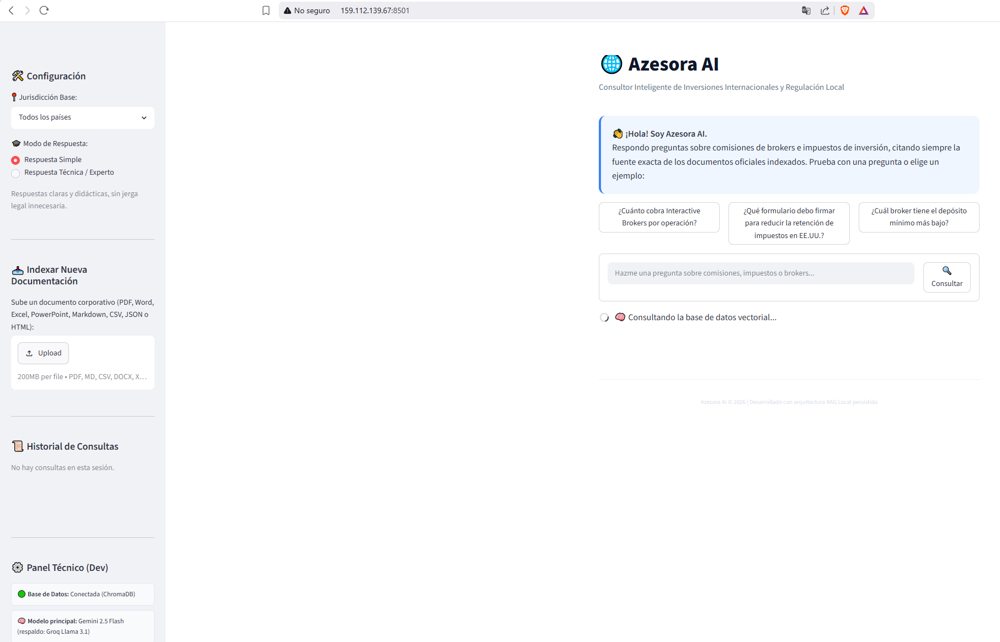
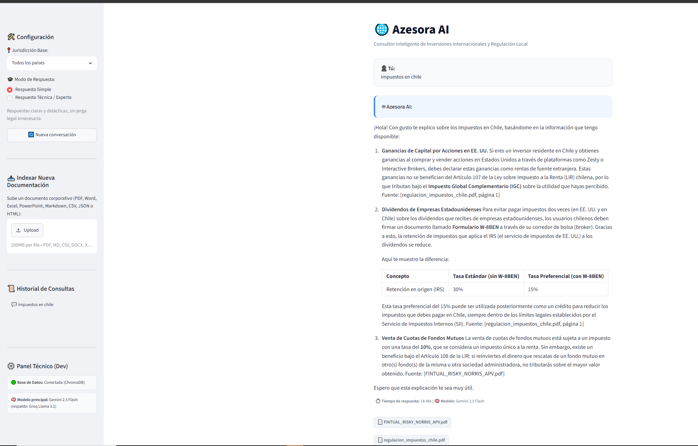

# 🌐 Azesora AI

**Asistente conversacional corporativo con arquitectura RAG (Retrieval-Augmented Generation), enfocado en inversiones internacionales y regulación fiscal.**

Azesora AI responde preguntas de colaboradores sobre comisiones de brokers, formularios tributarios y normativas de inversión, basándose **únicamente** en documentos oficiales indexados — sin inventar información, y citando siempre la fuente exacta (archivo y página) de cada afirmación.


---

## 🔗 Demo en vivo

| Entorno | URL | Notas |
|---|---|---|
| ☁️ Oracle Cloud Infrastructure | [159.112.139.67:8501](http://159.112.139.67:8501) | Instancia Compute Always Free (`VM.Standard.E2.1.Micro`), 1GB RAM — el primer arranque tras inactividad puede tardar varios minutos. |
| 🎈 Streamlit Community Cloud | [azesora-ai.streamlit.app](https://azesora-ai.streamlit.app/) | Despliegue gestionado directo desde este repositorio. Si el enlace no responde de inmediato, el contenedor puede estar "dormido" por inactividad — espera unos segundos a que arranque. |

## 📸 Demo en producción

**Azesora AI corriendo en la instancia de Oracle Cloud Infrastructure** (`159.112.139.67:8501`), con la pantalla de bienvenida y las preguntas de ejemplo:



**Consulta real respondida en producción**, citando la página exacta del documento fuente:



---

## 📋 Tabla de contenidos

- [Demo en vivo](#-demo-en-vivo)
- [Descripción del proyecto](#-descripción-del-proyecto)
- [Características principales](#-características-principales)
- [Arquitectura](#️-arquitectura)
- [Estructura del proyecto](#-estructura-del-proyecto)
- [Instalación local](#-instalación-local)
- [Variables de entorno](#-variables-de-entorno)
- [Cómo agregar o cambiar de proveedor de IA](#-cómo-agregar-o-cambiar-de-proveedor-de-ia)
- [Despliegue con Docker](#-despliegue-con-docker)
- [Despliegue en Oracle Cloud Infrastructure (OCI)](#️-despliegue-en-oracle-cloud-infrastructure-oci)
- [Desplegar tu propio fork en Streamlit Community Cloud](#-desplegar-tu-propio-fork-en-streamlit-community-cloud)
- [Contribuir](#-contribuir)
- [Mantenimiento y re-indexación](#-mantenimiento-y-re-indexación)
- [Registro y trazabilidad](#-registro-y-trazabilidad)
- [Limitaciones conocidas](#-limitaciones-conocidas)
- [Autor](#-autor)

---

## 🎯 Descripción del proyecto

El objetivo de Azesora AI es servir como base de conocimiento conversacional para un equipo de inversiones: en vez de que cada colaborador busque manualmente en PDFs, guías y planillas de comisiones, le pregunta directamente al agente y recibe una respuesta con la cita exacta del documento de origen.

El proyecto cubre el pipeline RAG completo:

1. **Colecta**: documentos en `data_source/`, organizados por jurisdicción.
2. **Ingesta**: extracción de texto de 8 formatos distintos (PDF, Word, Excel, PowerPoint, Markdown, CSV, JSON, HTML) y división en fragmentos (*chunks*).
3. **Indexación**: los fragmentos se convierten en vectores (*embeddings*) y se guardan en una base de datos vectorial local (ChromaDB).
4. **Recuperación**: ante una pregunta, se buscan los fragmentos más relevantes por similitud semántica y se reordenan (*reranking*) con un segundo modelo más preciso.
5. **Generación**: un LLM (Gemini, con respaldo automático a Groq) redacta la respuesta usando solo ese contexto, citando la fuente.
6. **Producción**: la app corre en Streamlit, containerizada con Docker, desplegada en una VM Compute de Oracle Cloud.

---

## ✨ Características principales

- **Ingesta multi-formato**: PDF (con número de página), Word, Excel, PowerPoint, Markdown, CSV, JSON y HTML — tanto en un pipeline batch (`data_source/`) como en un cargador en vivo desde la propia interfaz.
- **Citas verificables**: cada respuesta indica `Fuente: archivo.pdf, página X`; si el documento no tiene páginas (Markdown/CSV), cita solo el archivo.
- **Reranking**: un cross-encoder (`ms-marco-MiniLM-L-6-v2`) reordena los candidatos de la búsqueda vectorial por relevancia real antes de construir el contexto.
- **Umbral de confianza**: si ningún fragmento recuperado supera el umbral mínimo de relevancia, el agente responde que no tiene información suficiente **sin llamar al LLM** (ahorra costo y evita alucinaciones).
- **Verificación de consistencia**: si la respuesta generada no cita ninguna fuente reconocible, se le pide al modelo una corrección explícita antes de entregarla.
- **Fallback automático Gemini → Groq**: ante cuota agotada, error de autenticación o servicio caído de Gemini, la consulta se reintenta automáticamente con Groq (Llama 3.1), sin que el colaborador note la diferencia.
- **Modo Simple / Modo Experto**: alterna entre explicaciones didácticas y respuestas con rigor legal (citando artículos y formularios específicos).
- **Mantenimiento automático**: al iniciar, la app detecta (por hash SHA-256) si `data_source/` cambió desde la última vez y reindexa solo lo necesario.
- **Feedback y logging**: botones 👍/👎 por respuesta y registro estructurado en JSON Lines (`logs/consultas.jsonl`, `logs/feedback.jsonl`) con pregunta, contexto, respuesta, motor usado y tiempo — pensado para auditoría y mejora continua.
- **Imagen Docker optimizada**: ~790MB (torch CPU-only, sin las ~2.7GB de librerías CUDA innecesarias), pensada para correr incluso en instancias con recursos limitados.

---

## 🏗️ Arquitectura

```
┌─────────────┐     ┌──────────────┐     ┌───────────────┐
│ data_source/ │ --> │  src/ingesta  │ --> │ src/indexacion │ --> vector_db/ (ChromaDB)
│ (PDF/Word/…) │     │  (extracción  │     │  (embeddings)  │
└─────────────┘     │   + chunking) │     └───────────────┘
                     └──────────────┘

Usuario ──> app.py (Streamlit) ──> src/agente.py
                                       │
                                       ├─ 1. Búsqueda vectorial (k=12 candidatos)
                                       ├─ 2. Reranking (cross-encoder) → top 4
                                       ├─ 3. Umbral de confianza (¿hay contexto útil?)
                                       ├─ 4. LLM: Gemini 2.5 Flash (fallback: Groq Llama 3.1)
                                       ├─ 5. Verificación de consistencia (¿citó una fuente?)
                                       └─ 6. Log a logs/consultas.jsonl
```

**Modelo de embeddings**: `all-MiniLM-L6-v2` (HuggingFace, local, sin costo por uso) — el mismo modelo se usa tanto para indexar documentos como para codificar preguntas, condición necesaria para que la búsqueda por similitud funcione.

**Base de datos vectorial**: [ChromaDB](https://www.trychroma.com/), persistida en disco en `vector_db/`.

---

## 📁 Estructura del proyecto

```
azesora-ai/
├── app.py                  # Interfaz Streamlit (UI, sidebar, uploader, chat)
├── src/
│   ├── agente.py            # Lógica del RAG: búsqueda, reranking, LLM, fallback, logging
│   ├── ingesta.py            # Extracción de texto por formato + chunking
│   ├── indexacion.py         # Construcción del índice vectorial (ChromaDB)
│   └── mantencion.py         # Detección de cambios y reindexación automática
├── data_source/             # Documentos fuente, organizados por jurisdicción
│   ├── chile/
│   └── global/
├── generar_data.py          # Genera documentos de ejemplo (demo) desde cero
├── prueba.py                # Script de prueba rápida por consola
├── requirements.txt
├── Dockerfile
├── .dockerignore
└── .env                     # Claves API (no versionado)
```

---

## 🚀 Instalación local

### Prerrequisitos

- Python 3.11+
- Git
- Una clave de API de [Google AI Studio](https://aistudio.google.com/apikey) (Gemini) — gratuita
- Una clave de API de [Groq Console](https://console.groq.com/keys) (respaldo) — gratuita

### 1. Clonar el repositorio

```bash
git clone https://github.com/sergiorebolledo/azesora-ai.git
cd azesora-ai
```

### 2. Crear y activar un entorno virtual

```bash
python -m venv .venv

# Windows
.venv\Scripts\activate

# Linux / macOS
source .venv/bin/activate
```

### 3. Instalar dependencias

```bash
pip install -r requirements.txt
```

### 4. Configurar variables de entorno

Crea un archivo `.env` en la raíz del proyecto:

```env
GOOGLE_API_KEY=AIzaSy...
GROQ_API_KEY=gsk_...
```

- **`GOOGLE_API_KEY`**: generar en [Google AI Studio](https://aistudio.google.com/apikey). Debe empezar con `AIzaSy`.
- **`GROQ_API_KEY`**: generar en [Groq Console → API Keys](https://console.groq.com/keys). Empieza con `gsk_`.

> ⚠️ Nunca subas tu `.env` al repositorio. Ya está excluido en `.gitignore` y `.dockerignore`.

### 5. Ejecutar la aplicación

```bash
streamlit run app.py
```

En el primer arranque, la app detecta que no existe `vector_db/` y construye el índice automáticamente desde `data_source/` (ver [Mantenimiento y re-indexación](#-mantenimiento-y-re-indexación)). Abre `http://localhost:8501` en tu navegador.

---

## ⚙️ Variables de entorno

| Variable | Obligatoria | Descripción |
|---|---|---|
| `GOOGLE_API_KEY` | Sí | Clave de Gemini (motor principal). Formato `AIzaSy...`. |
| `GROQ_API_KEY` | Sí | Clave de Groq (respaldo automático). Formato `gsk_...`. |

---

## 🔑 Cómo agregar o cambiar de proveedor de IA

Toda la lógica del LLM vive en **`src/agente.py`**, dentro de la función `consultar_azesora`. El diseño actual es un `try/except` en cadena: intenta Gemini primero y, si falla por cuota, autenticación o servicio caído, reintenta con Groq.

### Agregar un tercer proveedor como respaldo adicional (ej. OpenAI, Anthropic, Cohere)

1. Instala el paquete de LangChain correspondiente, por ejemplo:
   ```bash
   pip install langchain-openai
   ```
   y agrégalo a `requirements.txt`.

2. Impórtalo en `src/agente.py`:
   ```python
   from langchain_openai import ChatOpenAI
   ```

3. En el bloque de fallback existente (líneas ~233-262 de `src/agente.py`), envuelve la llamada a Groq en su propio `try` y agrega un segundo nivel de respaldo en el `except`:
   ```python
   try:
       llm_respaldo = ChatGroq(model="llama-3.1-8b-instant", temperature=0.2, api_key=os.getenv("GROQ_API_KEY"))
       cadena_rag = prompt_template | llm_respaldo
       respuesta_ia = cadena_rag.invoke({"pregunta": pregunta})
       motor_usado = "Groq Llama 3.1 8B (respaldo)"
       llm_usado = llm_respaldo
   except Exception as e2:
       print(f"⚠️ Groq tampoco disponible ({e2}). Intentando con OpenAI...")
       llm_respaldo_2 = ChatOpenAI(model="gpt-4o-mini", api_key=os.getenv("OPENAI_API_KEY"))
       cadena_rag = prompt_template | llm_respaldo_2
       respuesta_ia = cadena_rag.invoke({"pregunta": pregunta})
       motor_usado = "OpenAI GPT-4o-mini (respaldo 2)"
       llm_usado = llm_respaldo_2
   ```

4. Agrega la nueva clave al `.env` (ej. `OPENAI_API_KEY=sk-...`) y a la tabla de [Variables de entorno](#-variables-de-entorno).

### Cambiar el modelo principal

Simplemente edita el nombre del modelo donde se instancia el cliente (línea ~182 de `src/agente.py`):

```python
llm = ChatGoogleGenerativeAI(
    model="gemini-2.5-flash",  # <- cambia aquí, ej. "gemini-2.0-flash" o "gemini-2.5-pro"
    temperature=0.2
)
```

Para reemplazar Gemini como motor principal por otro proveedor, sustituye esta instanciación por el cliente que prefieras (ej. `ChatOpenAI`, `ChatAnthropic`) — el resto del pipeline (búsqueda, reranking, prompt, logging) no necesita cambios, ya que todos los clientes de LangChain comparten la misma interfaz `invoke()`.

### Cambiar el modelo de embeddings o el reranker

- **Embeddings**: `HuggingFaceEmbeddings(model_name="all-MiniLM-L6-v2")` en `src/agente.py` (función `obtener_vector_store`) y en `src/indexacion.py`. **Debes usar el mismo modelo en ambos lugares** — si lo cambias, hay que re-indexar todo (`python src/indexacion.py`).
- **Reranker**: `CrossEncoder("cross-encoder/ms-marco-MiniLM-L-6-v2")` en `_obtener_reranker()` (`src/agente.py`). Cualquier cross-encoder de [sentence-transformers](https://www.sbert.net/docs/pretrained_cross-encoders.html) es compatible.

---

## 🐳 Despliegue con Docker

El `Dockerfile` usa `python:3.11-slim` e instala explícitamente la build **CPU-only** de PyTorch antes del resto de dependencias — el wheel estándar de Linux incluye ~2.7GB de librerías NVIDIA/CUDA innecesarias sin GPU, que inflan la imagen y ralentizan cualquier despliegue.

### Construir la imagen

```bash
docker build -t azesora-ai:latest .
```

### Ejecutar el contenedor

```bash
docker run -d --name azesora-app -p 8501:8501 --env-file .env azesora-ai:latest
```

Abre `http://localhost:8501`. El healthcheck integrado consulta `/_stcore/health` cada cierto intervalo.

> 💡 Si quieres que el contenedor arranque ya con el índice vectorial construido (evita reindexar en máquinas con poca RAM/CPU), quita `vector_db/` de `.dockerignore` y asegúrate de tener `vector_db/` generado localmente (`python src/indexacion.py`) antes de construir la imagen — `COPY . .` lo incluirá automáticamente.

---

## ☁️ Despliegue en Oracle Cloud Infrastructure (OCI)

Este proyecto está desplegado en una VM Compute de OCI dentro del nivel **Always Free**, usando el servicio de OCI **Compute** (cumple el requisito de usar al menos un servicio del ecosistema OCI). Guía para replicarlo:

### 1. Crear la red (VCN)

En **Networking → Virtual Cloud Networks**, crea una VCN con:
- Una subred pública (`prohibit-public-ip-on-vnic = false`).
- Un Internet Gateway, con una ruta `0.0.0.0/0` apuntando a él en la tabla de rutas.
- Reglas de ingreso en la Security List: TCP 22 (SSH) y TCP 8501 (Streamlit), origen `0.0.0.0/0` (o restringido a tu IP si prefieres más seguridad).

### 2. Crear la instancia Compute

- **Forma**: `VM.Standard.E2.1.Micro` (AMD, Always Free) o `VM.Standard.A1.Flex` (Ampere ARM, Always Free — más potente pero sujeta a disponibilidad de capacidad en la región).
- **Imagen**: Ubuntu 24.04 (o 22.04 Minimal).
- Adjunta tu llave pública SSH al crear la instancia.

> ⚠️ `VM.Standard.A1.Flex` frecuentemente devuelve `Out of host capacity` por alta demanda — si ocurre, `E2.1.Micro` suele tener disponibilidad inmediata, aunque con menos RAM (1GB, recomendable agregar swap).

### 3. Preparar la VM

```bash
ssh -i tu_llave.pem ubuntu@<IP_PUBLICA>

# Swap (recomendado en instancias con poca RAM)
sudo fallocate -l 4G /swapfile && sudo chmod 600 /swapfile
sudo mkswap /swapfile && sudo swapon /swapfile
echo "/swapfile none swap sw 0 0" | sudo tee -a /etc/fstab

# Docker
sudo apt-get update -y && sudo apt-get install -y ca-certificates curl git
sudo install -m 0755 -d /etc/apt/keyrings
sudo curl -fsSL https://download.docker.com/linux/ubuntu/gpg -o /etc/apt/keyrings/docker.asc
sudo chmod a+r /etc/apt/keyrings/docker.asc
echo "deb [arch=$(dpkg --print-architecture) signed-by=/etc/apt/keyrings/docker.asc] https://download.docker.com/linux/ubuntu $(. /etc/os-release && echo $VERSION_CODENAME) stable" | sudo tee /etc/apt/sources.list.d/docker.list
sudo apt-get update -y && sudo apt-get install -y docker-ce docker-ce-cli containerd.io
sudo usermod -aG docker ubuntu   # cierra sesión y vuelve a entrar para que aplique
```

### 4. Llevar la imagen a la VM

En instancias pequeñas, es más rápido **construir la imagen en tu máquina local y transferirla ya lista**, en vez de instalar todas las dependencias de Python dentro de la VM:

```bash
# En tu maquina local
docker save azesora-ai:latest | gzip > azesora-ai.tar.gz
scp -i tu_llave.pem azesora-ai.tar.gz ubuntu@<IP_PUBLICA>:~/

# En la VM
gunzip -c azesora-ai.tar.gz | docker load
```

### 5. Clonar el repo y correr el contenedor

```bash
git clone https://github.com/sergiorebolledo/azesora-ai.git
cd azesora-ai
nano .env   # pega tus API keys reales aquí

docker run -d --name azesora-app --restart unless-stopped \
  -p 8501:8501 --env-file .env azesora-ai:latest
```

Verifica con `curl http://localhost:8501/_stcore/health` (debe responder `200`) y abre `http://<IP_PUBLICA>:8501` desde tu navegador.

---

## 🎈 Desplegar tu propio fork en Streamlit Community Cloud

Es la forma más rápida de tener una copia propia en línea, sin manejar servidores — ideal para probar cambios o compartir tu versión.

1. **Haz un fork** de este repositorio a tu propia cuenta de GitHub (botón "Fork" arriba a la derecha en GitHub).
2. Entra a [share.streamlit.io](https://share.streamlit.io/) e inicia sesión con tu cuenta de GitHub.
3. Haz clic en **"New app"** y selecciona tu fork, la rama `main` y el archivo principal `app.py`.
4. Antes de desplegar, abre **"Advanced settings" → Secrets** y pega tus claves en formato TOML (Streamlit Cloud no usa `.env`, usa este mecanismo de *Secrets* en su lugar):
   ```toml
   GOOGLE_API_KEY = "AIzaSy..."
   GROQ_API_KEY = "gsk_..."
   ```
5. Haz clic en **"Deploy"**. La primera carga tarda unos minutos (instala dependencias y construye el índice vectorial desde `data_source/`).

> ⚠️ **Nota sobre `.env` vs Secrets**: como `python-dotenv` solo lee `.env` cuando existe, y Streamlit Cloud inyecta los *Secrets* como variables de entorno del proceso, `os.getenv("GOOGLE_API_KEY")` en `src/agente.py` los detecta igual sin ningún cambio de código — no necesitas tocar nada más.

> ⚠️ **Nota sobre los logs en Streamlit Cloud**: esa plataforma no da acceso al sistema de archivos del contenedor, así que `logs/consultas.jsonl` (que si es visible al correr localmente o en tu propia VM) **no se puede abrir ni descargar ahí**. Lo único visible es la consola de "Manage app → Logs", que muestra la salida estándar (`print(...)`) — por eso `src/agente.py` también imprime un resumen de cada consulta (motor usado, si hubo fallback, etc.) además de escribir el archivo. Ten en cuenta además que el contenedor de Streamlit Cloud es efímero: cada redeploy o reinicio por inactividad borra los archivos escritos en disco, incluidos los logs.

---

## 🤝 Contribuir

¿Tienes una mejora, un proveedor de IA distinto que quieras integrar, o un formato de documento adicional que soportar? Los pull requests son bienvenidos:

1. Haz un fork del repositorio.
2. Crea una rama descriptiva: `git checkout -b mejora/nombre-de-tu-cambio`.
3. Prueba tus cambios localmente (`streamlit run app.py`) antes de subirlos.
4. Abre un Pull Request describiendo qué cambia y por qué.

Ideas de mejoras abiertas (ver [Limitaciones conocidas](#-limitaciones-conocidas)): recalibración dinámica del umbral de reranking, soporte para más proveedores de LLM, panel de métricas a partir de `logs/consultas.jsonl`, autenticación básica para despliegues públicos.

---

## 🔄 Mantenimiento y re-indexación

`src/mantencion.py` compara un hash SHA-256 de cada archivo en `data_source/` contra un manifiesto guardado en `vector_db/.manifest_documentos.json`. Se ejecuta automáticamente al iniciar la app (`sincronizar_documentos_al_iniciar()` en `app.py`), y también puede correrse manualmente:

```bash
python src/mantencion.py
```

Si detecta archivos nuevos, modificados o eliminados, reindexa solo lo necesario; si no hay cambios, no hace nada (arranque instantáneo).

Para forzar una reconstrucción completa del índice:

```bash
python src/indexacion.py
```

---

## 📊 Registro y trazabilidad

Cada consulta se registra en `logs/consultas.jsonl` (formato JSON Lines, un objeto por línea):

```json
{"timestamp": "...", "pregunta": "...", "fragmentos_contexto": [...], "respuesta": "...", "modelo": "Gemini 2.5 Flash", "tiempo_segundos": 12.4}
```

El feedback del colaborador (👍/👎) se registra en `logs/feedback.jsonl`. Ninguno de los dos archivos se versiona en Git (contienen datos reales de uso).

---

## 🗺️ Limitaciones conocidas

- El umbral de confianza y el reranker están calibrados empíricamente contra el corpus de demostración; al crecer la base de documentos real, conviene re-calibrar `UMBRAL_RERANK_MINIMO` en `src/agente.py`.
- La cuota gratuita de Gemini es limitada (~20 consultas/día); el fallback a Groq cubre la mayoría de estos casos, pero ambos son niveles gratuitos con límites propios.
- En instancias con 1GB de RAM (`E2.1.Micro`), el primer arranque (carga de modelos) puede tardar varios minutos; se recomienda swap y, si el presupuesto lo permite, una instancia con más memoria.

---

## 👤 Autor

**Sergio Rebolledo Lopez**

Proyecto desarrollado como parte del Challenge AluraAgente del programa Oracle Next Education (ONE).
